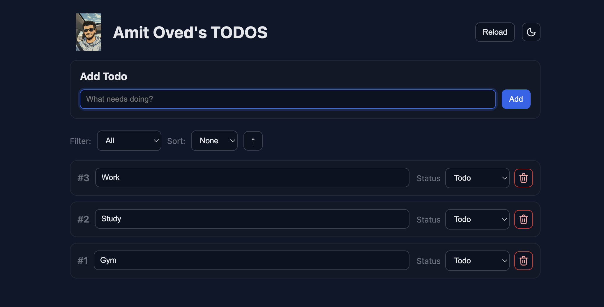

# 📝 TodoList App on Kubernetes


A full-stack microservices Todo application deployed on Kubernetes using Helm.
Developed as a final project for the **Kubernetes** course.

This project demonstrates real-world cloud-native practices including configuration management, security, scalability, and stateful workloads.

---

## 🏗️ Architecture

The system is composed of three main microservices:

| Component | Technology | Kubernetes Resource | Description |
| :--- | :--- | :--- | :--- |
| **Frontend** | Vue.js | `Deployment` + `HPA` | Web interface for managing tasks. |
| **Backend API** | Go Lang | `Deployment` | REST API handling logic. |
| **Database** | MariaDB | `StatefulSet` | Persistent storage for data. |

---
## 🚀 Key Features

* ✅ **Microservices Architecture:** Separated services for frontend, backend, and database.
* ✅ **Stateful Workload:** MariaDB runs as a `StatefulSet` with PVC to ensure stable storage and identity.
* ✅ **Dynamic InitContainer:** Automatically downloads and injects a custom title image based on Helm configuration.
* ✅ **Configuration Management:** Uses `ConfigMaps` and `Secrets` to decouple configuration from application code.
* ✅ **Security:** Implemented `NetworkPolicies` to restrict database access only to the backend service.
* ✅ **Autoscaling:** Frontend service is automatically scaled using Horizontal Pod Autoscaler (**HPA**).
* ✅ **Helm Packaging:** Fully packaged as a Helm chart and published to GitHub Container Registry (GHCR).

---

## 📦 Installation

You can install the chart directly from the GitHub Container Registry:

```bash
helm install my-todo oci://ghcr.io/am1its/todolist-k8s/todolist \
  --version 0.1.0 \
  --set database.rootPassword=secret123
```

---

## 🖥️ Usage

After installation, follow the instructions printed in `NOTES.txt`.
To access the app locally, run the following commands:

```bash
# 1. Expose the API (Backend)
kubectl port-forward svc/todos-api-svc 8081:8080 &

# 2. Expose the UI (Frontend)
kubectl port-forward svc/todolist-frontend 8000:80 &
👉 Open in Browser: http://localhost:8000
```

## 📸 Screenshots
Application Running




## 📊 Running Pods & Services
Example deployment status:

```Plaintext
NAME                      READY   STATUS    RESTARTS   AGE
pod/mariadb-0             1/1     Running   0          5m
pod/todolist-frontend-x   1/1     Running   0          5m
pod/todos-api-x           1/1     Running   0          5m
```
